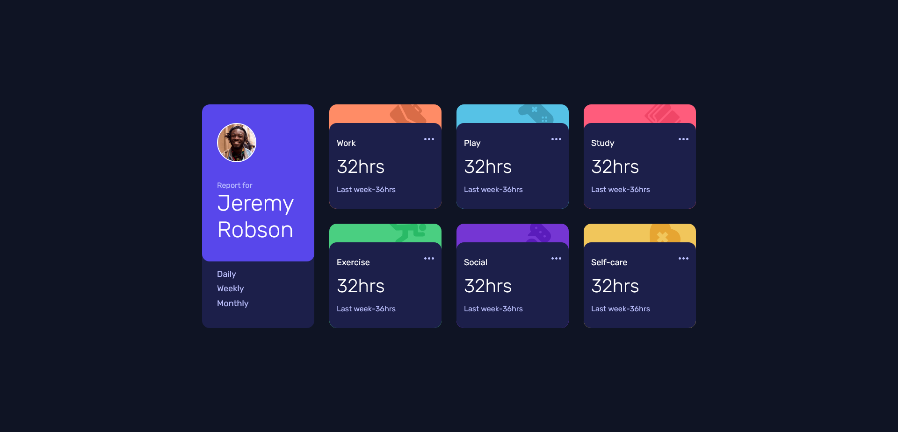
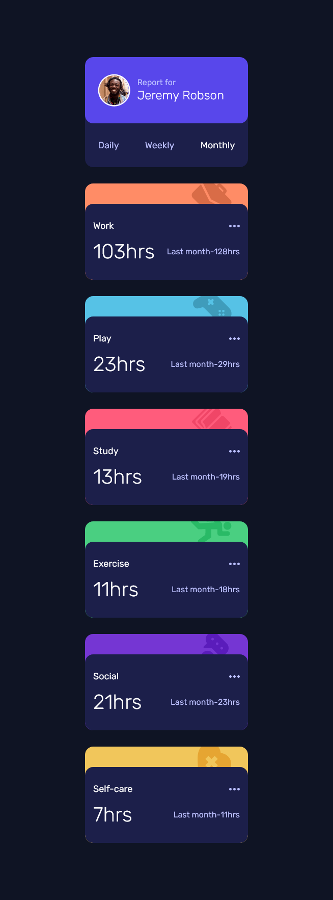

# Frontend Mentor - Time tracking dashboard solution

This is a solution to the [Time tracking dashboard challenge on Frontend Mentor](https://www.frontendmentor.io/challenges/time-tracking-dashboard-UIQ7167Jw). Frontend Mentor challenges help you improve your coding skills by building realistic projects.

## Table of contents

- [Overview](#overview)
  - [The challenge](#the-challenge)
  - [Screenshot](#screenshot)
  - [Links](#links)
- [My process](#my-process)
  - [Built with](#built-with)
- [Author](#author)
- [Acknowledgments](#acknowledgments)

## Overview
This is a solution to[Time tracking dashboard challenge on Frontend Mentor](https://www.frontendmentor.io/challenges/time-tracking-dashboard-UIQ7167Jw)

### The challenge

Users should be able to:

- View the optimal layout for the site depending on their device's screen size
- See hover states for all interactive elements on the page
- Switch between viewing Daily, Weekly, and Monthly stats

### Screenshot

### Links

- Solution URL: [Add solution URL here](https://your-solution-url.com)
- Live Site URL: [Add live site URL here](https://your-live-site-url.com)

### Links

- Solution URL: [Link to Github Solution](https://github.com/ajay0024/time-tracking-dashboard)
- Live Site URL: [Preview Live](https://ajay0024.github.io/time-tracking-dashboard/)

## My process
I build with mobile first workflow. Grids and Flexes are extensively used. JavaScript has been used to display data loaded from JSON file on the go. Data has been laid out from JSON file stored at https://api.npoint.io/f7b51fb38daba2c21786.

### Built with

- Semantic HTML5 markup
- CSS custom properties
- CSS Grids
- Flexbox
- JavaScript
- Mobile-first workflow

## Author

- Website - https://ajay0024.github.io/cv/
- Frontend Mentor - https://www.frontendmentor.io/profile/ajay0024
- Twitter - https://twitter.com/Python72000166

## Acknowledgments

This was inspirational. Will do more.
